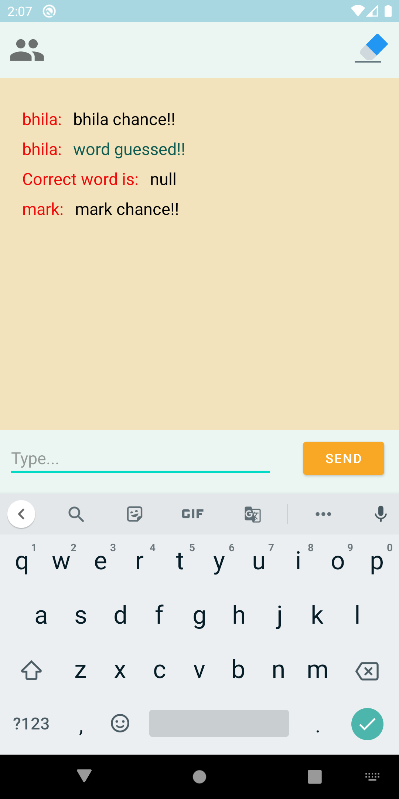

# Squiggle :smile:
Android Multiplayer Game of Drawing and Guessing. 
----
<kbd></kbd>
----
## All about Algorithm-Visualizer
Squiggle is an Online Multiplayer Drawing Game. In this you can Guess what your opponent is drawing and answer accordingly. You are awarded points for the correct answers and their is no negative markings for wrong answers. This time you can play online with your friends, other players around the World, or just guess the drawing or draw something for practice!
Use the Squiggle to draw on the screen while the app tracks and displays the sketch. Become part of the action as you interact with your sketch like charades while your opponents tries to guess as many clues as they can before time is up!

In the multiplayer mode, one player is selected as the artist, he is offered three words to choose from and his task is to draw the selected word. Other players try to guess what the artist is drawing. The winner is the player who first guesses the correct word.

## APPLICATION DISPLAY  :eyes:	
<kbd></kbd>
<kbd></kbd>
<kbd></kbd>
<kbd></kbd>
<kbd></kbd>
<kbd></kbd>
<kbd></kbd>
<kbd></kbd>


## YOUTUBE LINK:-
* <a href="https://youtu.be/JRrLZSIiWsE"> **Squiggle: Draw and Guess** </a> 


## Getting Started :+1:

These instructions will get you a copy of the project up and running on your local machine for development and testing purposes. See deployment for notes on how to deploy the project on a live system.

### Prerequisites

What things you need to install the software and how to install them

```
Things you need to install this mobile aplication->
1. Android Mobile
That's it!
```

### Installing

A step by step series of examples that tell you how to get a development env running

Say what the step will be

```
You can Download the application using below link-
https://play.google.com/store/apps/details?id=com.thelazypeople.scribbl
```
<a href="https://play.google.com/store/apps/details?id=com.thelazypeople.scribbl">**Google PlayStore**</a>
## Built With :heartbeat:

* Android Studio
* Kotlin

## Contributing

All kinds of contribution :heart_eyes: are welcomed.
- <a href="https://github.com/The-Lazy-People/Squiggle/pulls"> Make a Pull request </a>
- <a href="https://github.com/The-Lazy-People/Squiggle/issues"> Open Issue </a>

## Authors

* <a href="https://www.linkedin.com/in/abhishek-yadav-aps/"> **Abhishek Yadav** </a> 
* <a href="https://www.linkedin.com/in/2001adarshsingh/"> **Adarsh Singh** </a> 
* <a href="https://www.linkedin.com/in/ayushi-doshi-731210191/">  **Ayushi Doshi** </a>
* <a href="https://www.linkedin.com/in/sayantan-banerjee-19040b175/">  **Sayantan Banerjee** </a>

